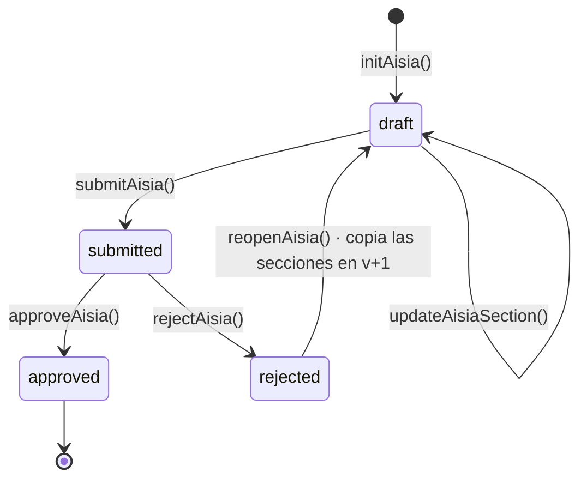

# AISIA — qué está implementado y cómo funciona

Auditoría del módulo de Evaluación de Impacto del Sistema de IA. Leyendo el código:
migraciones, acciones de servidor, pantalla y todos los puntos donde otros módulos lo
consumen.

**Respuesta corta:** sí está implementado, y el ciclo de vida completo funciona de punta a
punta. Pero tiene **un agujero de permisos**, **dos caminos por los que se puede aprobar
una evaluación vacía**, y **tres piezas que existen en la base de datos o en un catálogo y
no se ejecutan nunca**.

---

## 1 · Qué hay

### 1.1 · Modelo de datos

Tres tablas en el esquema `fluxion`:

| Tabla | Qué guarda | Estado |
|---|---|---|
| `aisia_assessments` | La evaluación: `status`, `version`, quién la creó, envió, aprobó o rechazó, y el motivo del rechazo | **En uso** |
| `aisia_sections` | Las seis secciones S1–S6, contenido en `data jsonb`, estado `pending / in_progress / complete` | **En uso** |
| `aisia_ai_generations` | «Historial de generaciones IA por sección AISIA. Inmutable.» | **Muerta** — ver 3.5 |

Con RLS activo en las tres, políticas por organización, `UNIQUE (ai_system_id, version)`,
`UNIQUE (assessment_id, section_code)`, borrado en cascada y triggers de `updated_at`.

El comentario de la tabla dice: *«Satisface controles ISO 42001 A.5.2–A.5.5 cuando
status = approved»*. Esa frase es la clave de todo lo que sigue: **el estado `approved` es
lo que produce efectos**, y por eso importa quién puede ponerlo.

### 1.2 · Ciclo de vida



Está todo implementado en
[`inventario/[id]/aisia/actions.ts`](../../apps/web/app/(app)/inventario/[id]/aisia/actions.ts):

- **`initAisia(systemId)`** — crea la evaluación y las seis secciones vacías. Calcula la
  versión siguiente. Impide que haya más de una activa (`draft` o `submitted`) por sistema.
  Si falla la creación de secciones hace *rollback* manual de la evaluación.
- **`updateAisiaSection(...)`** — guarda una sección. Rechaza si la evaluación no está en
  `draft`.
- **`submitAisia(id)`** — `draft → submitted`, sella `submitted_by` y `submitted_at`.
- **`approveAisia(id, minutesRef?)`** — `submitted → approved`, sella quién y cuándo.
- **`rejectAisia(id, reason)`** — `submitted → rejected` con motivo.
- **`reopenAisia(id)`** — desde una rechazada, crea la versión `v+1` en `draft` **copiando
  las secciones**. La rechazada se conserva para auditoría.

Cuatro de las cinco transiciones escriben un evento en el historial del sistema
(`aisia_created`, `aisia_submitted`, `aisia_approved`, `aisia_rejected`).

### 1.3 · La pantalla

[`aisia-wizard-client.tsx`](../../apps/web/app/(app)/inventario/[id]/aisia/[assessmentId]/aisia-wizard-client.tsx),
991 líneas. Asistente de seis secciones con barra lateral, indicador de progreso, guardado
por sección, botón «Marcar completa» y modo de sólo lectura fuera de `draft`.

| | Sección | Contenido |
|---|---|---|
| S1 | Descripción del sistema | Identificación, propósito y uso, contexto de despliegue, stack |
| S2 | Datos e información | Datos personales, categorías especiales, fuentes, estado DPIA |
| S3 | Modos de fallo identificados | Selección de modos del FMEA + narrativa de riesgos |
| S4 | Acciones de tratamiento | Planes de tratamiento + resumen y riesgo residual |
| S5 | Impacto en personas | Severidad, grupos vulnerables, derechos afectados, salvaguardas |
| S6 | Impacto social | Impacto social y consideraciones ambientales |

La aprobación y el rechazo no están aquí: viven en la pestaña **ISO 42001** de la ficha del
sistema, en [`system-detail-client.tsx`](../../apps/web/app/(app)/inventario/[id]/system-detail-client.tsx).

### 1.4 · Quién consume la AISIA

Un consumidor real y uno declarativo:

- **La Declaración de Aplicabilidad.** `analyzeSoAFromAisia()` lee las AISIA **aprobadas**
  de los sistemas en alcance, construye un contexto con 21 campos sacados de S1–S6 y
  propone aplicabilidad y justificación para cada control del Anexo A. **Esto funciona.**
  Es la razón por la que el SoA exige tener una AISIA aprobada antes.
- **`lib/templates/data.ts`** expone un `aisiaStatusMap` con el último estado por sistema.

### 1.5 · Cómo se llega — y por qué no se encuentra

Hay **un solo camino** en toda la aplicación:

> `Inventario` → abrir un sistema → pestaña **ISO 42001** (la 3.ª de 7) → tarjeta
> **«Evaluación de Impacto (AISIA)»** → botón **«Iniciar evaluación AISIA»**

Atajo por URL: `/inventario/<id>?tab=iso`, porque `TAB_QUERY_MAP` acepta la clave `iso`.
El asistente vive después en `/inventario/<id>/aisia/<assessmentId>`.

La pestaña y la tarjeta se pintan **sin ninguna condición** —no hay módulo que las active
ni rol que las oculte—, así que están siempre ahí. El problema no es que estén cerradas:
es que nada apunta a ellas.

- **No hay entrada en el menú lateral.** El grupo `Cumplimiento → ISO 42001` tiene
  exactamente un hijo: «Declaración de Aplicabilidad». AISIA no figura en ningún grupo.
- **Sólo existen tres enlaces al asistente en todo el código**, y los tres están dentro de
  esa misma tarjeta (`system-detail-client.tsx:1271`, `:1278` y `:1827`).
- **La pantalla llamada «Evaluaciones» no la incluye.** `buildEvaluationsDashboardData`
  consulta `ai_systems`, `system_failure_modes`, `fmea_evaluations`, `treatment_plans`,
  `fmea_items` y `tasks`. `aisia_assessments` no aparece: ese módulo es sólo el FMEA.
- **El dashboard nunca la recomienda.** Ninguna de las seis ramas de `getNextStep` la
  menciona (ver [`flujo-completo.md`](../producto/flujo-completo.md), §7.3).
- **El SoA la exige y no enlaza a ella.** `analyzeSoAFromAisia` devuelve *«Aprueba al menos
  una AISIA antes de usar esta función»*: dice lo que falta, no dónde está.

**Consecuencia:** el único artefacto imprescindible para poder elaborar la Declaración de
Aplicabilidad está detrás de una pestaña interior de la ficha de cada sistema, sin enlace
desde ninguna parte, sin recomendación y sin listado propio. Un usuario que no lo sepa de
antemano no llega.

Y no hay vista agregada: para saber qué sistemas tienen AISIA y en qué estado, hay que
abrirlos uno a uno. El dato existe —`lib/templates/data.ts` ya construye un
`aisiaStatusMap` por sistema— pero no se muestra en ninguna pantalla de inventario.

---

## 2 · Cómo funciona, en la práctica

El recorrido que hace una persona:

1. Ficha del sistema → pestaña **ISO 42001** → «Iniciar evaluación AISIA».
2. Se abre el asistente en `/inventario/[id]/aisia/[assessmentId]` con las seis secciones
   vacías y **los campos de S1 y S2 pre-rellenados visualmente desde la ficha del sistema**
   (marcados con una insignia «Pre-relleno»).
3. Se recorre sección a sección. Cada salto guarda la sección actual. «Marcar completa» la
   pone en verde.
4. En la última sección, «Enviar para aprobación» → `submitted`.
5. Vuelta a la pestaña ISO 42001. Quien tenga rol `org_admin`, `sgai_manager` o `caio` ve
   los botones **Aprobar** / **Rechazar**.
6. Aprobada, la evaluación queda sellada y pasa a alimentar el análisis del SoA.

---

## 3 · Lo que está roto o inerte

Por orden de gravedad.

### 3.1 · `approveAisia` no comprueba el rol — **el más grave**

El comentario del código dice literalmente:

```ts
// ─── approveAisia ─────────────────────────────────────────────────────────────
// Aprueba la evaluación (submitted → approved). Solo admins/dpo.
```

Pero la función hace:

```ts
const { data: profile } = await fluxion
  .from('profiles')
  .select('id, organization_id')   // ← no lee `role`
  .eq('user_id', user.id)
  .single();
```

y nunca vuelve a mirar el perfil salvo para sacar `organization_id`. **No hay comprobación
de rol en ninguna parte del servidor.** Lo mismo en `rejectAisia`.

La única barrera es del lado cliente, en `system-detail-client.tsx:1358`:

```tsx
{userRole && (APPROVER_ROLES as readonly string[]).includes(userRole) && ( … )}
```

Eso **oculta los botones**, no impide la llamada. Una acción de servidor es un endpoint
HTTP, invocable por cualquiera con sesión.

Y la RLS no lo cubre: la política de UPDATE sobre `aisia_assessments` es sólo de
organización —

```sql
CREATE POLICY aisia_assessments_update ON fluxion.aisia_assessments
  FOR UPDATE USING (organization_id IN (SELECT profiles.organization_id …))
```

— sin ninguna condición de rol.

**Consecuencia:** cualquier miembro de la organización puede aprobar su propia AISIA. Y el
estado `approved` es lo que, según el comentario de la tabla, satisface los controles ISO
42001 A.5.2–A.5.5 y lo que habilita el análisis del SoA. Es decir, **la firma que sostiene
el cumplimiento no está protegida**.

Compárese con el SoA, que sí resuelve la puerta de rol en el servidor, y con C3, donde
quién puede decidir se calcula en base de datos (`approval_can_decide`).

### 3.2 · Se puede enviar y aprobar una AISIA completamente vacía

`submitAisia` comprueba que la evaluación exista, pertenezca a la organización y esté en
`draft`. **No comprueba el contenido de las secciones.**

Y el cliente tampoco:

```tsx
<button onClick={handleSubmit} disabled={isSubmitting || isSaving}>
  Enviar para aprobación →
</button>
```

El botón sólo se deshabilita mientras hay una operación en curso. `handleSubmit` guarda
**únicamente la sección actual** marcándola `complete` y envía. El contador
`completedCount` se calcula y sólo se pinta en la barra de progreso: no condiciona nada.

**Consecuencia:** crear una AISIA, pulsar «Siguiente» cinco veces, enviar y aprobar
produce una evaluación `approved` con seis secciones `{}`. Esa evaluación habilita el
análisis del SoA, que recibirá veintiún campos con el valor `—`.

### 3.3 · El pre-relleno se ve pero no se guarda

Los campos de S1 y S2 se pintan así:

```ts
const str = (key, fallback = '') => String(data[key] ?? system[key] ?? fallback);
```

`system` es la ficha del sistema. Pero el estado local del asistente se inicializa **sólo
desde la base de datos**:

```ts
const [sectionData, setSectionData] = useState(() => {
  const init = {};
  for (const s of aisia.sections) init[s.section_code] = s.data;
  return init;
});
```

y al guardar se envía `sectionData[code]`. Un campo pre-rellenado que el usuario no toca
**nunca entra en `data`** y por tanto no se persiste.

**Consecuencia, y es la peor de las tres:** `analyzeSoAFromAisia` lee
`s1.intended_use`, `s2.processes_personal_data` y demás **de la sección guardada**, no de la
ficha del sistema. Una AISIA que en pantalla se ve completa llega al análisis del SoA como
una fila de guiones. El usuario no tiene forma de notarlo: la pantalla le enseña los datos.

La insignia «Pre-relleno» refuerza el malentendido — dice que el dato está ahí, y no está.

### 3.4 · S3 etiqueta todos los modos de fallo con la palabra «rule»

En la selección de modos de fallo de la sección S3:

```tsx
<span className="font-plex text-[11.5px] font-semibold text-ltt">
  {fm.activation_source ?? fm.failure_mode_id}
</span>
```

`activation_source` es cómo se activó el modo: `rule`, `ai` o `manual`. Y tiene valor por
defecto `rule` y es `NOT NULL`, así que el `??` no entra casi nunca.

**Consecuencia:** la pantalla pide *«selecciona los modos de fallo relevantes»* y presenta
una lista de casillas **todas llamadas "rule"**, distinguibles sólo por su etiqueta de
dimensión y prioridad. La consulta que las trae
([`page.tsx:98`](../../apps/web/app/(app)/inventario/[id]/aisia/[assessmentId]/page.tsx#L98))
ni siquiera pide el nombre al catálogo, así que el propio `fallback` mostraría un UUID.

Y da igual lo que se seleccione: `selected_failure_mode_ids` se escribe en el JSONB y
**no lo lee nadie**. El análisis del SoA sólo mira `s3.risk_summary`, el texto libre.

### 3.5 · `aisia_ai_generations` es una tabla muerta, y no hay generación con IA

La tabla existe con todo el aparato: `prompt_summary`, `generated_content`, `model_used`,
`triggered_by`, `accepted`, `accepted_at`, un CHECK sobre `section_code`, RLS, políticas de
SELECT e INSERT, permisos, y el comentario «Historial de generaciones IA por sección AISIA.
Inmutable.»

**Cero referencias en toda la aplicación.** Ni una lectura, ni una escritura.

Su pareja, `aisia_sections.last_generated_at`, se selecciona en dos consultas y **nunca se
escribe**.

No hay ningún botón de generar, ninguna llamada a un modelo, ningún prompt, en ninguna
parte del módulo. La infraestructura para una funcionalidad que no existe.

> Contrasta con el SoA, que **sí** tiene generación real: `suggestSoAJustification` y
> `analyzeSoAFromAisia`.

### 3.6 · No existe `superseded`: dos versiones aprobadas conviven

El CHECK admite `draft`, `submitted`, `approved`, `rejected`. No hay estado de sustitución,
y `approveAisia` no degrada las versiones aprobadas anteriores.

`initAisia` sólo bloquea si hay una activa en `draft` o `submitted`. Con una única
evaluación en `approved`, deja crear la v2 — que es lo correcto para reevaluar. Pero al
aprobar la v2, **quedan dos filas en `approved` para el mismo sistema**.

Y `analyzeSoAFromAisia` filtra así:

```ts
.eq('status', 'approved')
.in('ai_system_id', inScopeIds)
```

Sin ordenar por versión ni quedarse con la última. **Al modelo se le mandan las dos
versiones del mismo sistema, contradiciéndose**, etiquetadas con el mismo nombre. Lo mismo
en `syncAisiaSoaControls`.

### 3.7 · `syncAisiaSoaControls` no se dispara nunca

Al aprobar una AISIA se llama a esta función, que debería marcar como `implemented` los
controles A.5.2–A.5.5 del SoA cuando todos los sistemas vinculados tengan AISIA aprobada.

Depende de la tabla `organization_soa_system_links`. **Ninguna parte de la aplicación
escribe en esa tabla** — sólo aparece en el esquema, en los ficheros legados y en un
inventario de base de datos. Así que:

```ts
if (!links || links.length === 0) continue;  // sin sistemas vinculados → no aplica aún
```

se cumple siempre y la función recorre el bucle sin hacer nada. El comentario «Fase 7»
promete un efecto que no ocurre, y el `console.log` de confirmación no se imprime jamás.

### 3.8 · «Evaluación AISIA» es un tipo de aprobación de C3 que nada abre

`APPROVAL_OBJECT_TYPES` ofrece cinco tipos en la configuración de políticas de Ajustes:

```ts
{ key: 'treatment_plan',   label: 'Plan de tratamiento' },
{ key: 'aisia_assessment', label: 'Evaluación AISIA' },
{ key: 'document',         label: 'Documento regulatorio' },
{ key: 'soa',              label: 'Declaración de Aplicabilidad' },
{ key: 'evidence',         label: 'Evidencia' },
```

Pero `approval_open` se invoca **en un solo sitio** de toda la aplicación: las acciones del
plan de tratamiento. Los otros cuatro tipos se pueden configurar con pasos, decisores y
delegaciones, y **no se disparará ninguna solicitud nunca**.

Es exactamente el problema que tenían los webhooks antes de arreglarlos, y se resuelve
igual: una marca `implemented` en el catálogo, para que la pantalla ofrezca lo que no
existe **diciéndolo**.

Esto explica además la incoherencia señalada en [`flujo-completo.md`](../producto/flujo-completo.md):
la AISIA se aprueba por su vía propia, sin política, sin pasos, sin delegación y sin acta.

### 3.9 · La AISIA no produce ningún documento

`document_templates_key_check` admite `annex_iv`, `model_card`, `fria`, `dpia` y
`approval_minutes`. **No hay plantilla de AISIA.** No se puede exportar, ni imprimir, ni
entra en el expediente del sistema. Existe sólo como pantalla.

Para un artefacto cuyo propósito es demostrar cumplimiento de ISO 42001 ante un auditor,
esto es una carencia de fondo.

### 3.10 · Defectos menores, todos del mismo tipo

- **Consultas sin comprobar el error.** En
  [`page.tsx`](../../apps/web/app/(app)/inventario/[id]/aisia/[assessmentId]/page.tsx#L98)
  se destructura `{ data: failureModeRows }` y `{ data: treatmentPlanRows }` sin mirar
  `error`. Si la consulta falla, S3 muestra *«Sin análisis FMEA disponible»* — indistinguible
  de que el sistema no tenga modos activados. Es el mismo fallo que dejó cinco pantallas en
  blanco en producción.
- **`treatment_plans` sin filtro de organización.** Esa consulta filtra sólo por
  `system_id`, a diferencia de todas las demás del fichero. Hoy lo cubre la RLS, pero es
  una inconsistencia que sólo protege una capa.
- **`rejectAisia` no valida el motivo.** Acepta cadena vacía. C3 sí lo exige para rechazar.
- **`reopenAisia` no escribe evento de historial.** Las otras cuatro transiciones sí. Crear
  la v2 de una evaluación no deja rastro en el historial del sistema.
- **Se puede borrar una AISIA aprobada.** La política de DELETE es de organización y no hay
  trigger de inmutabilidad: una evaluación aprobada, con sus secciones, desaparece sin
  rastro. `approval_decisions`, en C3, sí es inmutable.
- **El score ISO legado se sigue escribiendo.** `calcISO` y `buildIsoChecksSnapshot` se
  ejecutan en cada guardado del formulario de alta, sobre columnas marcadas
  `[DEPRECATED desde 2026-04-28] Sustituido por aisia_assessments`, y la ficha los muestra.
  Conviven dos mediciones de lo mismo.

---

## 4 · Resumen

| | Estado |
|---|---|
| Modelo de datos, RLS, versionado | ✅ Correcto |
| Ciclo de vida completo (init → submit → approve/reject → reopen) | ✅ Funciona |
| Acceso desde la interfaz | ⚠️ **Existe, pero no se encuentra** — ver 1.5 |
| Vista agregada del estado por sistema | ❌ No existe |
| Asistente de 6 secciones, guardado, sólo lectura | ✅ Funciona |
| Historial de auditoría | ⚠️ Falta el evento de reapertura |
| Alimentar el análisis del SoA | ✅ Funciona — con la salvedad de 3.3 y 3.6 |
| Control de quién aprueba | ❌ **Sólo en el cliente** |
| Validación de completitud | ❌ No existe |
| Persistencia del pre-relleno | ❌ No se guarda |
| Etiquetas de los modos de fallo en S3 | ❌ Muestra «rule» |
| Generación con IA | ❌ Tabla y columna muertas, sin funcionalidad |
| Sustitución de versiones anteriores | ❌ No existe |
| Sincronización con controles A.5.x del SoA | ❌ No se dispara nunca |
| Integración con C3 | ❌ Declarada en el catálogo, sin emisor |
| Salida documental | ❌ No hay plantilla |

## 5 · Orden de arreglo sugerido

1. **Comprobar el rol en el servidor** en `approveAisia` y `rejectAisia`. Es el único
   hallazgo con consecuencia de seguridad y son cuatro líneas.
1 bis. **Hacerlo encontrable.** Sin esto lo demás da igual: por muy bien que funcione, hoy
   sólo llega quien ya sabe dónde está. Tres cosas, de menos a más esfuerzo: una columna de
   estado AISIA en el listado de inventario (el `aisiaStatusMap` ya existe), una regla en
   `getNextStep` («plan aprobado y sin AISIA → iniciarla»), y un enlace desde el mensaje de
   error del SoA al sistema que le falta.
2. **Persistir el pre-relleno** al inicializar `sectionData` (fusionar los valores de la
   ficha del sistema), o dejar de mostrarlo. Hoy la pantalla miente.
3. **Etiquetar bien los modos de fallo** en S3: traer el nombre del catálogo en la consulta.
4. **Exigir completitud** antes de enviar: seis secciones en `complete`, comprobado también
   en el servidor.
5. **Marcar `superseded`** al aprobar una versión nueva, y que `analyzeSoAFromAisia` se
   quede con la última.
6. **Decidir sobre lo inerte**: o se implementa (`aisia_ai_generations`, los enlaces
   control↔sistema, la solicitud C3 de tipo `aisia_assessment`, la plantilla documental) o
   se retira del catálogo y del esquema. Lo que no puede quedarse es ofrecido y sin emisor.
