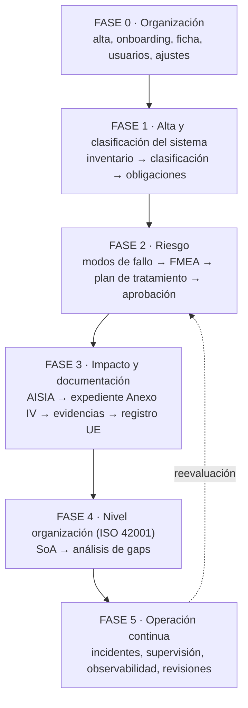

# El flujo completo de trabajo en Fluxion

De dar de alta la empresa a tener evaluación de riesgos, planes de tratamiento,
Declaración de Aplicabilidad y análisis AISIA.

Escrito leyendo el código, no de memoria. Cada paso indica la pantalla real, qué produce,
qué necesita antes y si impide continuar.

**Relación con los otros documentos.** [`circuito.md`](circuito.md) describe las 8 etapas
del recorrido **de un sistema** y diagnostica dónde está la complejidad. Este documento es
más ancho: arranca en el alta de la organización y termina en los artefactos de nivel
organización (SoA, análisis de gaps) y en la operación continua. Donde se solapan, ambos
dicen lo mismo.

---

## 0 · Mapa general

Cinco fases. Las dos primeras son de configuración y ocurren una vez; las tres siguientes
se repiten por sistema y por ciclo.

**La dependencia que más gente se salta:** el SoA no se puede analizar sin al menos una
AISIA **aprobada**, y la AISIA pide en sus secciones 3 y 4 los modos de fallo y las
acciones de tratamiento. Es decir, **FMEA → plan → AISIA → SoA**, en ese orden, y no es
opcional: está comprobado en código.

---

## FASE 0 · Poner en pie la organización

Una sola vez. Sin esto, todas las pantallas redirigen a `/onboarding`.

### 0.1 · Alta y onboarding — `/onboarding`

Cuatro pasos:

| Paso | Qué se pide |
|---|---|
| 1 · Perfil de la organización | Sector industrial, país de operación, apetito al riesgo, tamaño, módulos normativos activos, logotipo |
| 2 · Cumplimiento ISO | Estado frente a ISO 42001 (sin certificación / en proceso / certificado), fecha y organismo certificador, estado del inventario de sistemas IA, madurez de gobernanza (Inicial / En desarrollo / Avanzado / Optimizado) |
| 3 · Foco inicial | Inventario · Cumplimiento · Riesgos · Gobernanza — determina qué guía de primeros pasos se muestra en el dashboard |
| 4 · Completado | — |

**Se puede omitir cada paso.** El único efecto de omitirlos es que el dashboard arranca sin
contexto y la guía de primeros pasos por defecto es «Inventario».

Al crear el usuario, el trigger `grant_trial_modules()` activa cinco módulos en modo
`trial` con 30 días. Se gestionan después desde `/organizacion` → Módulos.

### 0.2 · Ficha de la organización — `/organizacion`

Siete pestañas. **La que importa para el cumplimiento es Gobernanza**, porque nombra a las
personas que después firman:

- **Identidad** — nombre, logo, identidad visual.
- **Datos legales** — razón social, NIF, domicilio.
- **Perfil regulatorio** — sector, país, volumen de empleados, alcance geográfico, módulos
  normativos aplicables, apetito al riesgo.
- **Gobernanza** — **Responsable del SGAI** (nombre y email), **Delegado de Protección de
  Datos** (nombre, email, teléfono), **Auditor externo designado** (empresa, contacto,
  acreditación).
- **Operaciones** — datos operativos.
- **Módulos** — activación, tipo (`enabled` / `trial` / `disabled`) y vigencia; selector de
  30/60/90/120 días y renovación.
- **Plan** — suscripción.

### 0.3 · Usuarios y roles — `/usuarios`

Invitación y asignación de rol. Determina quién puede aprobar qué más adelante, así que
conviene hacerlo **antes** de configurar políticas de aprobación.

### 0.4 · Ajustes — `/ajustes`

- **Conectores** — GitHub, MLflow y demás; alimentan Descubrimientos, que propone sistemas
  a dar de alta.
- **Canales de aviso** — Slack, correo.
- **Webhooks** — entrega de eventos a sistemas del cliente.
- **Políticas de aprobación** — define los circuitos de firma. **Sin política aplicable, el
  paso de aprobación simplemente no existe**, y el objeto se queda sin firmar sin que nada
  lo advierta.

---

## FASE 1 · Dar de alta y clasificar un sistema

Se repite por cada sistema.

### 1.1 · Registrar el sistema — `/inventario/nuevo`

Formulario de **7 pasos**: Identificación · Propósito · Impacto · Datos · Tecnología ·
Gobierno · Controles. Alrededor de 70 campos, de los que una docena son obligatorios.

Alternativa: **`/inventario/descubrimientos`**, donde los conectores proponen activos
detectados para convertirlos en sistemas.

Lo que hay que tener a mano antes de empezar: uso previsto y usos prohibidos, responsable
del sistema, bases legales del tratamiento y rol frente al sistema (proveedor, responsable
del despliegue, importador, distribuidor, representante autorizado — **no son excluyentes**).

> Lo que este formulario **no** recoge está inventariado en
> [`ficha-tecnica-vs-formulario.md`](ficha-tecnica-vs-formulario.md): contrato con el
> proveedor, alojamiento y medidas de seguridad, básicamente.

### 1.2 · Clasificar según el AI Act — `/inventario/[id]/clasificacion`

El motor `classifyAIAct` calcula nivel de riesgo (prohibido / alto / limitado / mínimo /
GPAI), la base de la clasificación y los avisos. Se ejecuta ya en el alta y se puede
recalcular aquí.

**No bloquea nada**, pero condiciona todo lo que viene: el nivel de riesgo determina las
obligaciones, y el motor de recomendación del dashboard sólo persigue los sistemas de
**alto riesgo**.

### 1.3 · Revisar las obligaciones derivadas — ficha del sistema, pestaña «Obligaciones AI Act»

`v_system_obligations` cruza el nivel de riesgo con el rol en la cadena de valor y produce
las obligaciones aplicables con su artículo. Es la pestaña que se abre por defecto en la
ficha del sistema, y la lista de trabajo real de cumplimiento.

La ficha del sistema tiene siete pestañas: **Obligaciones AI Act · Ficha técnica · ISO
42001 · Historial · Evidencias · Modos de fallo · Plan de tratamiento**. El orden en el que
aparecen es, a grandes rasgos, el orden en el que se trabajan.

---

## FASE 2 · Evaluar y tratar el riesgo

Esto es el **Art. 9** del Reglamento: identificar riesgos, estimarlos, adoptar medidas y
que alguien juzgue aceptable el residual.

### 2.1 · Activar los modos de fallo — ficha del sistema, pestaña «Modos de fallo»

**Este es el único portón duro de todo el recorrido.** Sin modos de fallo activados,
`getOrCreateEvaluation` devuelve `missingFailureModes` y el FMEA no arranca.

Los modos **no se eligen a mano**: un motor determinista los activa a partir de las
características del sistema (`activation_source` por defecto es `rule`; también admite `ai`
y `manual`). Lo manual es la excepción.

El catálogo tiene 418+ modos anclados a artículo, agrupados en **10 familias**.

### 2.2 · Evaluar — `/inventario/[id]/fmea` → `/fmea/[evaluationId]/evaluar`

Estados de la evaluación: `draft → in_review → approved → superseded`.

Dos maneras de trabajar, y conviene saberlo antes de empezar:

- **Estimación por familia** — se estima una vez por familia (10 estimaciones) y se
  detallan sólo las excepciones. Es lo que reduce el trabajo medido de ~119 evaluaciones
  manuales (unas 6 h por sistema) a 10 estimaciones más excepciones.
- **Modo a modo** — para los sistemas donde haga falta ese detalle.

Cada ítem admite `pending | evaluated | skipped`. **Saltarse un modo es una salida
legítima**, contemplada en el modelo, no un atajo.

`/fmea/[evaluationId]/comparar` compara versiones de evaluación.

### 2.3 · Definir el plan de tratamiento — `/fmea/[evaluationId]/plan`

Estados: `draft → in_review → approved → in_progress → closed → superseded`.

`/plan/summary` da la vista de resumen. Las acciones incompletas impiden enviarlo a
aprobación.

Vista agregada de todos los planes de la organización: **`/planes`**.

### 2.4 · Registrar los riesgos de negocio — `/inventario/[id]/riesgos-negocio`

**Vía paralela, no normativa.** Probabilidad × impacto con exposición calculada; aceptar un
riesgo exige justificación (lo impone un CHECK en base de datos). Sirve para los riesgos
técnicos y de ROI que no son incumplimientos pero sí decisiones.

No bloquea nada y no entra en el expediente regulatorio. Se puede hacer en cualquier
momento después del alta.

### 2.5 · Aprobar — `/aprobaciones`

Si hay política aplicable, la solicitud recorre sus pasos con decisores, delegaciones y
`policy_snapshot` congelado. Al cerrarse genera el **acta de aprobación**, un documento
derivado íntegramente de los datos.

**Si no hay política aplicable, este paso no ocurre.** Es la razón por la que conviene
configurarlas en la fase 0.

---

## FASE 3 · Impacto y documentación del sistema

### 3.1 · Análisis de impacto AISIA — `/inventario/[id]/aisia`

Ciclo de vida: `draft → submitted → approved` (o `rejected`, y `reopen` crea una versión
nueva). **Sólo puede haber una evaluación activa** (`draft` o `submitted`) por sistema.

Seis secciones:

| | Sección | Depende de |
|---|---|---|
| S1 | Descripción del sistema | Ficha del sistema (fase 1) |
| S2 | Datos e información | Paso «Datos» del alta |
| S3 | **Modos de fallo identificados** | **FMEA (2.1–2.2)** |
| S4 | **Acciones de tratamiento** | **Plan de tratamiento (2.3)** |
| S5 | Impacto en personas | — |
| S6 | Impacto social | — |

Las secciones **nacen vacías**. El sistema completo se pasa como contexto a la pantalla,
de modo que se puede generar contenido y editarlo, pero no hay volcado automático: hay que
revisarlas una a una.

**Por qué va aquí y no antes:** S3 y S4 piden precisamente lo que producen el FMEA y el
plan. Arrancar la AISIA antes obliga a rellenarlas a mano y luego a rehacerlas.

### 3.2 · Expediente y documentos — `/inventario/[id]/expediente`, `/anexo-iv`, `/technical-dossier`

El motor documental genera desde los datos: **Expediente del Anexo IV**, **FRIA**, **DPIA**,
**Model Card** y **acta de aprobación**. Todos versionados, con estados
`draft → in_review → approved → superseded`.

### 3.3 · Evidencias — `/inventario/[id]/evidencias` y `/evidencias`

Adjuntar las pruebas que sostienen cada obligación. El mapeo *obligación ↔ tipo de
evidencia* vive en `/datos/mappings/obligacion-evidencia`.

### 3.4 · Registro UE — `/inventario/[id]/eu-registry`

Sólo para sistemas de alto riesgo. Prepara los datos del registro del Art. 49/71.

### 3.5 · Informe de gaps del sistema — `/inventario/[id]/gap-report`

Lo que falta para este sistema en concreto.

---

## FASE 4 · Nivel organización (ISO 42001)

### 4.1 · Declaración de Aplicabilidad — `/plantillas/soa-iso42001`

El único artefacto del recorrido que es **de la organización, no de un sistema**. Por eso
va al final: se alimenta de lo que se ha hecho en los sistemas.

Secuencia exacta, con las dos comprobaciones que la bloquean:

1. **Inicializar** el SoA (`initializeSoA`) — crea el documento en estado `draft` con el
   catálogo de controles del Anexo A.
2. **Definir los tags de alcance** en la cabecera (`scope_system_tags`). Determinan qué
   sistemas entran en el SGAI.
   → *Sin tags de alcance no falla, pero entran **todos** los sistemas.*
3. **Analizar desde AISIA** (`analyzeSoAFromAisia`) — lee las AISIA **aprobadas** de los
   sistemas en alcance, construye el contexto con las seis secciones y propone
   aplicabilidad y justificación para cada control.
   → **Portón duro:** si no hay ninguna AISIA aprobada, devuelve
   *«No hay evaluaciones AISIA aprobadas para los sistemas en alcance. Aprueba al menos una
   AISIA antes de usar esta función.»*
   → **Portón duro:** si ningún sistema está en alcance, devuelve
   *«No hay sistemas en alcance. Define tags de alcance en la cabecera del SoA primero.»*
4. **Aplicar las sugerencias** (`applySoASuggestions`), revisando control a control.
   `suggestSoAJustification` ayuda con la redacción de cada justificación;
   `bulkUpdateApplicability` permite marcar varios de golpe.
5. **Comprobar la completitud** (`checkSoACompleteness`).
6. **Transicionar el estado** (`transitionSoAStatus`): `draft → under_review → approved`.
   **Fuera de `draft` el documento es de sólo lectura.** Para cambiar algo hay que abrir una
   revisión nueva.

Todo el ciclo queda en el log (`getSoALifecycleLog`) y el histórico de versiones en
`getSoAHistory`.

### 4.2 · Análisis de gaps — `/gaps`

**Pantalla de lectura.** Consolida brechas normativas, estado del FMEA, tratamiento
pendiente y caducidades próximas, y deriva al módulo de origen para actuar. No se «ejecuta»
un análisis: se mira.

`/gaps/snapshots` congela el estado en un momento dado y `/gaps/snapshots/compare` compara
dos fotos — que es como se demuestra progreso ante un auditor.

---

## FASE 5 · Operación continua

Lo que pasa después, y que es donde vive la mayor parte del tiempo de una organización:

| Módulo | Para qué | Cadencia |
|---|---|---|
| `/incidentes` | Incidentes graves con los plazos del Art. 73 | Por suceso |
| `/supervision` | Supervisión humana operativa (HITL), Art. 14 | Continua |
| `/observabilidad` | Métricas del sistema en producción | Continua |
| `/tareas` y `/kanban` | Ejecución de las acciones del plan | Continua |
| `/planes/revisiones-pendientes` | Planes que tocan revisar | Según `review_frequency` |
| `/aprobaciones` | Decisiones pendientes de firma | Por suceso |

**Los disparadores de reevaluación** (vuelta a la fase 2):

- Llega la fecha de `next_audit_date` o vence la `review_frequency` del sistema.
- Cambia el sistema: nuevo uso, nuevo modelo, nuevo proveedor.
- Un incidente revela un modo de fallo no contemplado.
- Cambia la normativa o el catálogo de modos.

Cada reevaluación crea una **versión nueva** —de la evaluación FMEA, de la AISIA, del SoA—
y la anterior pasa a `superseded`. No se sobrescribe nada.

---

## 6 · Resumen en una tabla

El orden recomendado completo, con lo que bloquea de verdad:

| # | Paso | Dónde | ¿Bloquea lo siguiente? |
|---|---|---|---|
| 1 | Onboarding | `/onboarding` | **Sí** — sin él, todo redirige aquí |
| 2 | Ficha de organización (Gobernanza) | `/organizacion` | No, pero sin responsables no hay quien firme |
| 3 | Usuarios y roles | `/usuarios` | No |
| 4 | Políticas de aprobación | `/ajustes` | No — pero sin política, el paso 12 no existe |
| 5 | Registrar el sistema | `/inventario/nuevo` | **Sí** — sin sistema no hay nada |
| 6 | Clasificar (AI Act) | `…/clasificacion` | No |
| 7 | Revisar obligaciones | ficha → Obligaciones | No |
| 8 | Activar modos de fallo | ficha → Modos de fallo | **Sí** — el FMEA no arranca sin ellos |
| 9 | Evaluar (FMEA) | `…/fmea/[id]/evaluar` | Parcial — se admite `skipped` |
| 10 | Plan de tratamiento | `…/fmea/[id]/plan` | No |
| 11 | Riesgos de negocio *(opcional)* | `…/riesgos-negocio` | No |
| 12 | Aprobar | `/aprobaciones` | Sólo si hay política aplicable |
| 13 | AISIA | `…/aisia` | **Sí para el SoA** — y S3/S4 necesitan 9 y 10 |
| 14 | Expediente y documentos | `…/expediente` | No |
| 15 | Evidencias | `…/evidencias` | No |
| 16 | Registro UE *(alto riesgo)* | `…/eu-registry` | No |
| 17 | SoA | `/plantillas/soa-iso42001` | **Sí** — exige alcance y ≥1 AISIA aprobada |
| 18 | Análisis de gaps | `/gaps` | No — es de lectura |
| 19 | Operación y reevaluación | varios | Cíclico |

---

## 7 · Lo que la aplicación recomienda hoy, y en qué se queda corto

Esta sección es el hallazgo del análisis, y conviene leerla antes de dar el documento por
bueno como descripción de lo que el producto *hace*.

### 7.1 · La guía de primeros pasos

`OnboardingGuide` muestra **tres pasos** en el dashboard, distintos según el foco elegido en
el onboarding:

| Foco | Los tres pasos que propone |
|---|---|
| Inventario | Registrar sistema → Clasificar según AI Act → Medir cumplimiento |
| Cumplimiento | Registrar sistema → Ejecutar análisis de gaps → Priorizar y asignar acciones |
| Riesgos | Registrar sistema → Iniciar FMEA → Definir plan de tratamiento |
| Gobernanza | Configurar la organización → Asignar miembros al comité → Registrar sistema |

Tres pasos de diecinueve. Está bien como arranque, pero **no es el recorrido**, y nada en la
pantalla dice que haya más.

Un matiz sobre el foco «Cumplimiento»: propone «ejecutar el análisis de gaps», y `/gaps` es
una pantalla de **lectura** que consolida lo que ya existe. Siguiendo esa guía al pie de la
letra se llega a un radar vacío.

### 7.2 · El «siguiente paso recomendado» del dashboard

`getNextStep` evalúa en cascada y devuelve **el primero que se cumpla**:

1. ¿Cero sistemas? → **Registrar primer sistema**
2. ¿Algún sistema de **alto riesgo** sin modos de fallo? → **Activar modos de fallo**
3. ¿Alguna evaluación FMEA en `draft`? → **Continuar evaluación FMEA**
4. ¿Algún plan de tratamiento en `draft`? → **Completar plan de tratamiento**
5. ¿Evidencias en `draft` o `pending_review`? → **Revisar evidencias pendientes**
6. Si no → **el sistema con menor nivel de cumplimiento**

### 7.3 · Lo que el motor nunca recomienda

Contrastando esa cascada con el recorrido de diecinueve pasos:

- **Nunca menciona la AISIA.** Ni para iniciarla, ni para enviarla, ni para aprobarla. Una
  organización que siga el dashboard no llega nunca al análisis de impacto.
- **Nunca menciona el SoA.** Que además es el artefacto con más dependencias de todo el
  producto, y el que más fácilmente se emprende en el orden equivocado.
- **Nunca menciona clasificar** el sistema ni revisar sus obligaciones. Salta del alta
  directamente a los modos de fallo.
- **Nunca menciona la aprobación**, ni siquiera cuando hay una decisión pendiente de firma.
- **Sólo persigue los sistemas de alto riesgo** en el paso 2. Un sistema de riesgo limitado
  sin modos de fallo no genera ninguna recomendación: el motor lo da por atendido.
- **Nunca menciona las revisiones vencidas**, aunque `/planes/revisiones-pendientes` existe y
  `review_frequency` está en la ficha de cada sistema.

Dicho de otro modo: **el motor de recomendación cubre los pasos 5 y 8–10, y los pasos 15 de
refilón.** Los otros catorce dependen de que alguien sepa que existen.

### 7.4 · Dos consecuencias prácticas

**Para quien use Fluxion hoy:** este documento es la guía; el dashboard no basta.

**Para el producto:** extender `getNextStep` con los eslabones que faltan es una mejora
pequeña y de efecto grande, y hay orden natural para hacerlo —

1. Sistema sin clasificar → clasificarlo.
2. Plan aprobado sin AISIA → iniciar la AISIA.
3. AISIA aprobada y SoA sin inicializar → inicializar el SoA.
4. SoA en `draft` con controles sin justificar → completarlo.
5. Revisión vencida (`next_audit_date` pasada) → reevaluar.
6. Solicitud de aprobación pendiente en la que el usuario puede decidir → decidir.

---

## 8 · Una inconsistencia que conviene resolver

Hay **dos mecanismos de aprobación distintos** conviviendo:

- El de la AISIA, propio del módulo: `submitAisia` / `approveAisia` / `rejectAisia` /
  `reopenAisia`.
- El del SoA, propio también: `transitionSoAStatus` entre `draft`, `under_review` y
  `approved`.
- Y el genérico **C3** (`/aprobaciones`), con políticas, pasos, delegaciones, decisiones
  inmutables y acta generada.

Los dos primeros son anteriores a C3 y no pasan por él. El resultado es que una AISIA y un
SoA se aprueban **sin política, sin pasos, sin acta y sin la trazabilidad** que sí tiene un
plan de tratamiento. Para un auditor eso es una diferencia visible entre dos documentos del
mismo expediente.

No es un fallo que rompa nada hoy, pero sí una deuda que crece con cada documento que se
aprueba por la vía antigua.
